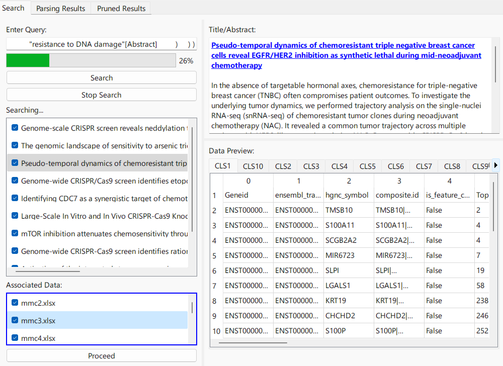

# Meta-Analyser

## Overview

    

This is a tool designed to automate data search and extraction from the scientific literature, as well as to facilitate its pre-cleaning. 

**Why would anyone want such a tool?** Despite ongoing progress in standardising sharing of scientific data in databases and online repositories, there remain large bodies of valuable information locked within the supplementary files of publications, often inconsistently formatted so as to be unamenable to automated pipelines. At the same time, for mature fields, attempts to integrate insights from this kaleidoscopic array of data files across hundreds of publications is a herculean effort to undertake, so researchers are typically forced to cherry pick. Recent algorithmic developments have emerged enabling *meta-analytic* approaches to the aggregation of "big data" (as from high throughput genetic screens and various '-omics') across multiple studies, but their widespread use is rate-limited by the amount manual data ingestion and cleaning needed to get such projects off the ground. 

This tool aims to provide a supervised interface, plus a few useful backend tools, to remove as much manual labour from the process as possible while making necessary manual work as painless as possible.

In its current form, the tool searches PubMed Central open access articles (using the normal PMC search syntax) and automatically retrieves supplementary files. It includes a processing workflow that attempts to parse out discrete data frames from often inconsistently formatted .xlsx and .csv files provided with academic publications. Users can preview data files and select the ones they want to process. Once processing is complete, the user again has the opportunity to further refine the data by filtering unwanted tables and selecting specific data features. The data is stored in a local SQLite database.

## Features

- Search for scientific articles based on a query
- Download supplementary files linked to the articles
- Process tables from supplementary files and store them in a local SQLite database
- Filter tables using a custom query engine that provides a "pubmed like" search syntax 

## WIP Features

- OpenAI header row detection (the most common edge case not handled by my table parser is non-header header rows containing irrelevant text)
- Session saving - save not only the final processed tables in a DB, but the entire app state (which papers you initially searched, which you excluded) will be able to be saved. This allows you to retrace your steps, or revise them.

## A note about the nature of this project

My current priorities as build out this tool are to:

1. Facilitate my own research
2. Help solve a worthy problem for the wider bioscience community

In that order, for now.

Thus, while I have gotten it to a point where it can facilitate my own work (being familiar as I am with its quirks, happy enough with its performance on my specific computer, etc), it is not by any means ready for prime time. I offer it publicly now to allow any motivated and helpful people who are perhaps interested in the concept try it out and let me know if they run into any specific issues (besides that it's slow, the UI is ugly, etc).

I recognise that in some sense this tool likely succeeds or fails for goal (2) first and foremost on its UX, and I am not a frontend developer. If you are a scientist who is interested in helping in any way, please reach out! I would love to hear from you. While the source code is currently closed (it will be opened up once it is published) we are happy to collaborate with individual scientists or groups who think they could help improve it.